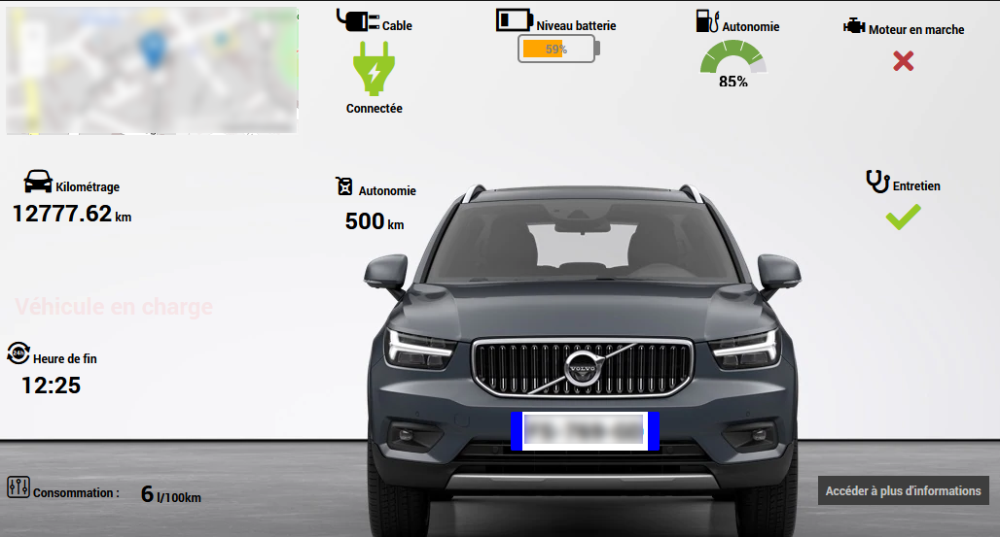
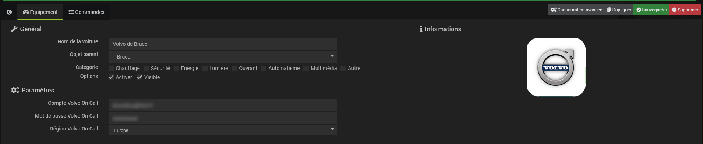
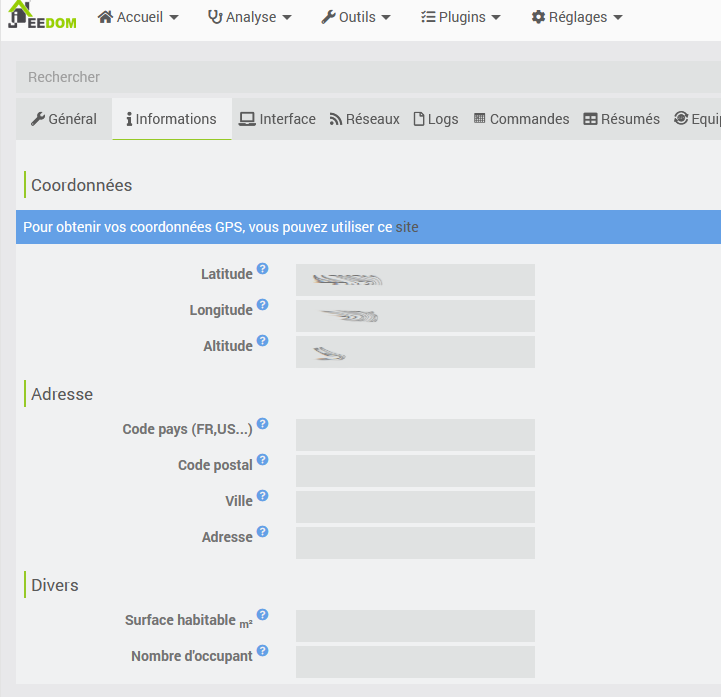
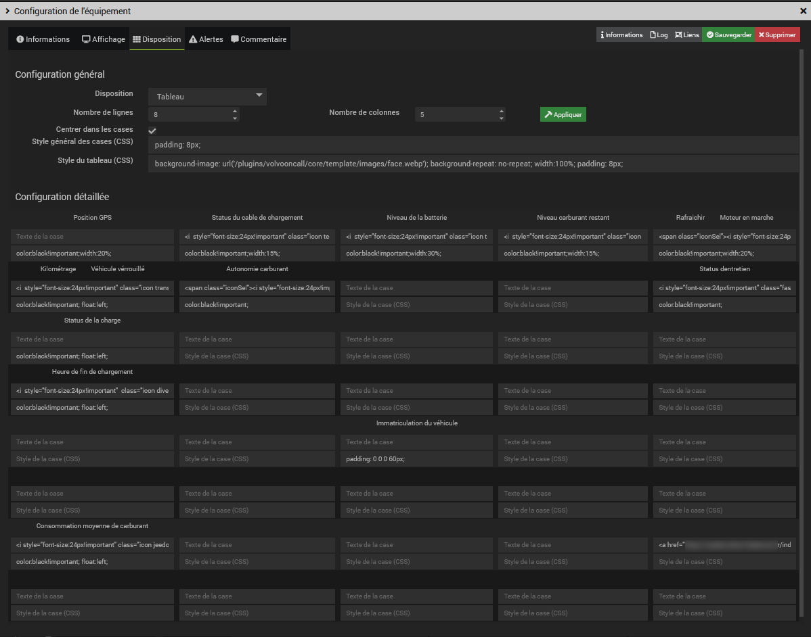
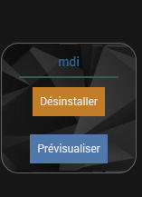
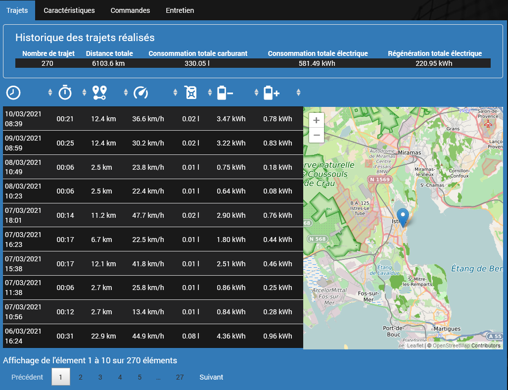
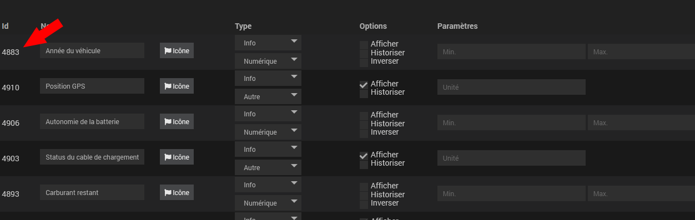
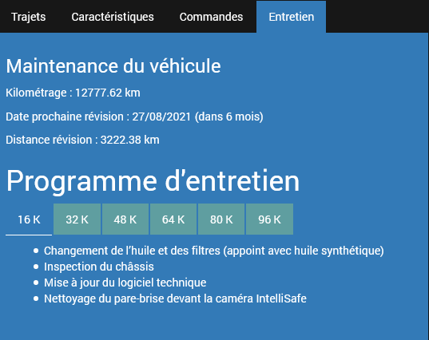

# Documentation du plugin volvooncall

## Notes importantes
--
L'API utilisée est celle de Wirelesscar et n'a pas de documentation !
--
VOLVO a tout d'abord opté pour ce choix pour un "clé en main" mais sont en train de développer leur propre API. 
Vous pouvez la retrouver [ici](https://developer.volvocars.com/volvo-api). 
Elle est assez prometteuse mais ne permet pas, pour le moment, de faire autant de chose que sa concurrente. 

Un script python existe [ici](https://github.com/molobrakos/volvooncall) et je m'en suis largement inspiré ainsi que celui développé par Lelas pour les voitures Peugeot. 
Merci à eux !

## Fonctions

Ce plugin permet d'accèder aux informations de votre voiture connectée Volvo :
- Quasiment tous les capteurs (ampoules, lave-glace, liquide de freins, statistiques, pression des pneus, etc...)

Il permet également d'accéder au trajets des 100 derniers jours avec les détails :
- départ/arrivée
- consommation
- moyenne de vitesse

Il permet aussi, si votre voiture le supporte, quelques actions distantes : -> en développement
- Moteur : couper et mettre en route
- Climatisation : préconditionnement du véhicule avec gestion de Timers
- Vérrouilage : portes et fenêtres

Les informations disponibles dans le widgets sont:
* Charge de la batterie, autonomie et kilométrage de la voiture
* Information sur le chargement de la batterie (Prise connectée, fin de chargement, etc...)
* Nombre de jours et kilomètres jusqu'au prochain entretien du véhicule -> dans un code HTML
* Situation du véhicule sur une carte (Position GPS).

  

## Installation
Par source Github:
* Aller dans Jeedom menu Plugins / Gestion des plugins
* Sélectionner le symbole + (Ajouter un plugin)
* Sélectionner le type de source Github (Il faut l'avoir autorisé au préalable dans le menu Réglages / Système / Configuration => Mise à jour/Market)
* Remplir les champs:
  * ID logique du plugin : volvooncall
  * Utilisateur ou organisation du dépôt : BruceLIOU
  * Nom du dépôt :  jeedom-plugin-volvooncall
  * Branche : master ou dev
* Aller dans le menu "plugins/objets connectés/Volvo On Call" de jeedom pour installer le nouveau plugin.

Sur la page configuration du plugin, saisir vos identifiants de compte Volvo On Call et votre région*. 
*Fonction en cours de développement

## Configuration
Une fois l'installation effectuée: 
Sur l'onglet "**Equipement**", choisissez l'objet parent et rendez le actif et visible. 
Renseigner vos identifiants Volvo On Call ainsi que votre région (Europe par défaut)*. 
*Fonction en cours de développement

  

La plugin à besoin de connaitre les coordonnées GPS de stationnement habituel de la voiture.  
Pour cela, il faut renseigner ces coordonnées GPS dans la page de configuration de jeedom.  
Règlages => Système => Configuration => Informations

  

## Widget
Les widgets sont configurés automatiquement par le plugin lors de la création de l'équipement. 
Il est possible d'agencer les éléments dans les widgets par la fonction d'édition du dashboard. 
Je propose l'agencement suivant comme exemple, en utilisant la présentation en tableau dans Configuration Avancée=>Disposition (voir ci dessous)  
Une image d'un Volvo XC40 est proposé en background. 
** Bonus avec le plugin HTML display pour un affichage dans un design** 
Créer un design  
Ajouter un lien (avec l'id de votre design) en bas de tableau pour accéder au détail du véhicule. 

    <a href="/index.php?v=d&p=plan&plan_id=60" class="btn btn-primary btn-volvooncall">Accéder à plus d'informations</a>

Créer un template HTML (plugin HTML display) avec le code fournit (docs/TBL_html_display.html) en adaptant le code selon vos commandes (commentaires dans le code)

  

## Bonus (code HTML avec le widget HTML display)
# Pré-requis
* Vous devez modifier certaines partie du code pour l'adapter à votre usage
- lignes de 228 à 236 avec les Id de vos commandes
- ligne 420 avec l'ID de votre commande vin
- lignes 556 et 557 avec les coordonnées GPS de votre domicile
* Installation du plugin icon
* Installation du pack mdi

  

Cette page permet de consulter les informations suivantes sur 4 onglets différents:
* Historique des trajets & liste des trajets effectués par le véhicule
* Caractéristiques du véhicule et statistiques sur l'utilisation et la consommation du véhicule -> en cours de développement
* Commandes (démarrage/véreouillage/climatisation/...) -> en cours de développement
* Informations sur les visites d'entretien du véhicule recommandées par Volvo (commentaire dans le code)

**Affichage des trajets:** 
<strike>Il est possible de définir une période soit par 2 dates, soit par des racourcis ('Aujourd'hui', 'hier', 'les 7 derniers jours' ou 'tout'), puis d'afficher l'ensemble des trajets sur cette période.</strike> 
La suite de la page est mise à jour avec l'affichage des trajets <strike>sélectionnés</strike>, en tableau et en affichage sur une carte. (Openstreet map)  
On peut sélectionner un trajet dans le tableau pour l'afficher sur la carte.  
<i>En préparation : ajout de point GPS intermédiaires pour afficher le trajet complet</i> 
Un résumé sur l'ensemble des trajets sélectionnés et donné également sur cette page.

  

**Caractéristiques & Statistiques:** -> en cours de développement 
Présentations sous forme de graphe de quelques statistiques d'utilisation du véhicule. 
Adaptez le code en modifiant les ID de vos commandes (commentaire dans le code)

  

* Distances parcourues 
* Consommation du véhicule au 100 km
* Energie consommée et coût estimé

**Commandes du  véhicule:** -> en cours de développement 
Vous retrouverez les mêmes commandes que l'application Volvo On Call

**Visites d'entretien:** 
L'onglet affiché est celui en rapport à votre kilométrage. 
Ces informations sont estimatives et approximatives. 
Adaptez le code en modifiant la date de 1ère mise en circulation (commentaire dans le code)

  

**Bugs connus:** 
Cette version 1.0 est encore en développement. Il y a quelques bugs connus mais non pénalisants
* <strike> Javascript erreur : "ReferenceError: L is not defined" (affichée dans la barre de titre de jeedom)  </strike>
* Les markers ne s'affichent pas correctement sur la carte (HTML display)

**Suite prévue pour ce plugin:**
* Implémentation API Volvo (quand elle sera plus complète)
* Ajouter le pilotage du préconditionnement du véhicule par Timers
* Envoyer des trajets au véhicule
* Exporter les trajets (pdf ou xls) pour des notes de frais par exemple
* Ajouter des points GPS intermédiaires pour afficher les trajets complets (interval de 5 minutes)
